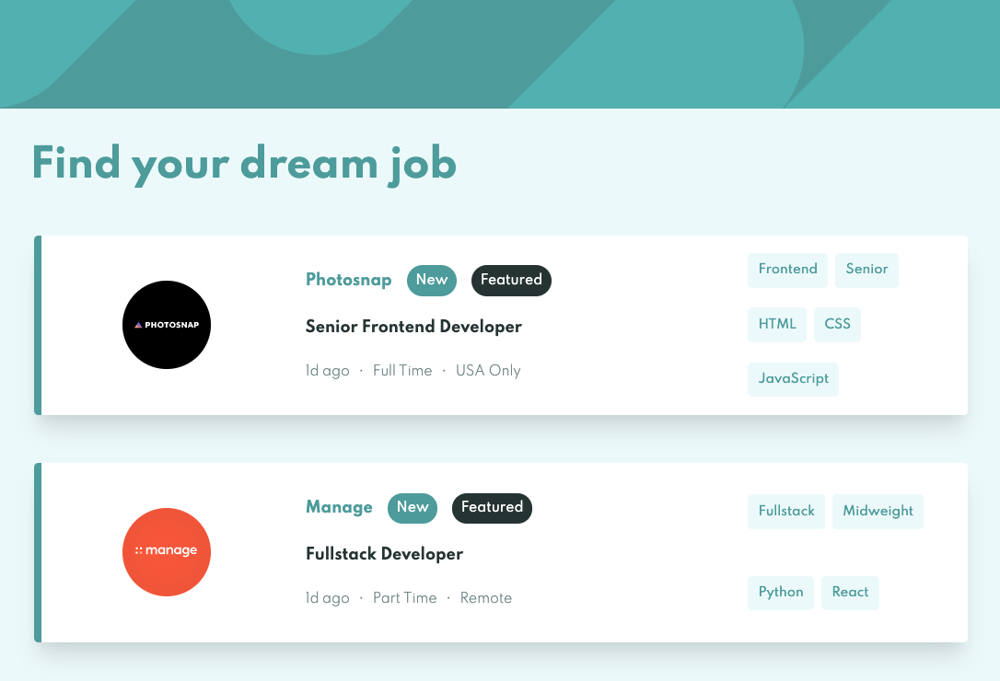
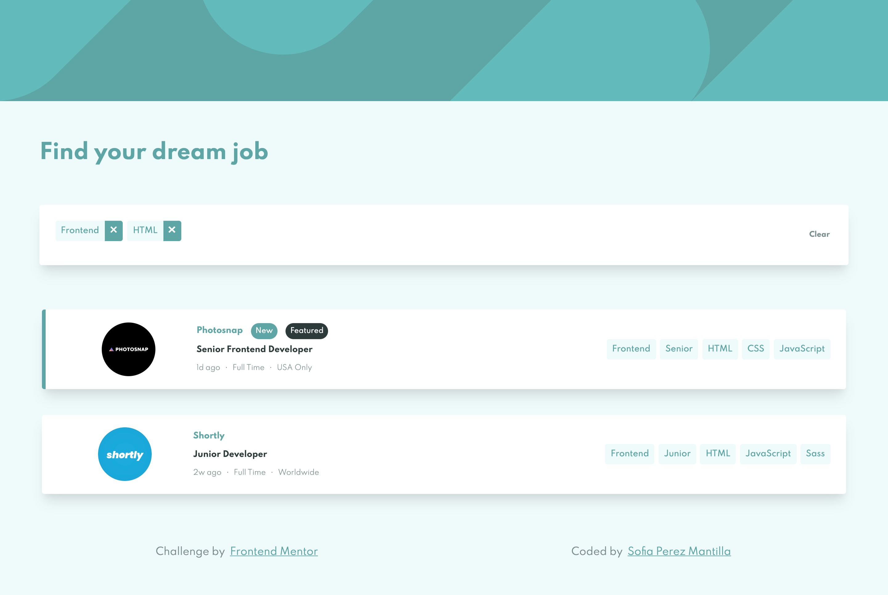

# Frontend Mentor - Job listings with filtering solution

This is a solution to the [Job listings with filtering challenge on Frontend Mentor](https://www.frontendmentor.io/challenges/job-listings-with-filtering-ivstIPCt). Frontend Mentor challenges help you improve your coding skills by building realistic projects. 

## Table of contents

- [Overview](#overview)
  - [The challenge](#the-challenge)
  - [Screenshot](#screenshot)
  - [Links](#links)
- [My process](#my-process)
  - [Built with](#built-with)
  - [What I learned](#what-i-learned)
  - [Continued development](#continued-development)
  - [Useful resources](#useful-resources)
- [Author](#author)
- [Acknowledgments](#acknowledgments)

## Overview

### The challenge

Users should be able to:

- View the optimal layout for the site depending on their device's screen size
- See hover states for all interactive elements on the page
- Filter job listings based on the categories

### Screenshot




### Links

- Solution URL: [Solution on Frontend Mentor](https://www.frontendmentor.io/solutions/mobilefirst-job-listings-with-filters-using-vanilla-javascript-OPXN9kr7Z)
- Live Site URL: [Live Site on GitHub Pages](https://sofiaperezm.github.io/job-listings-challenge/)

## My process

### Built with

- Semantic HTML5 markup
- Flexbox
- CSS Grid
- Mobile-first workflow
- Vanilla Javascript

### What I learned

In regards to the project and tasks organization for this challenge, I found useful to break down the challenge into smaller pieces of work, and to make commits for small chunks of code helped me to track better the progress.

In the technical stuff, I learned how to apply:

- Named parameters in functions using object literals.

```js
function createCardElement({ elementType, container, properties, attributes }) {
  //..
}
```

- The spread operator.

```js
cardElement.setAttribute("data-labels", [job.role, job.level, ...job.languages, ...job.tools]);
```

- A more functional way to write JavaScript.

I also practiced a lot of how to manipulate the DOM (create elements, add classes, set/get attributes, and so on). 

- Working on a mobile-first approach taking the best of Flexbox and CSS Grid.


```css
/* card element in smaller viewports */
.card {
    display: flex;
    flex-direction: column;
    flex-wrap: wrap;
}

/* card element in medium viewports*/
.card {
        display: grid;
        grid-template-columns: 1fr 2fr 1fr;
    }
```

### Continued development

I would like to focus on understanding event listeners in depth in my next code challenge. I also want to learn how to avoid as much as possible repetitive code in CSS. 

### Useful resources

- [A Complete Guide to Flexbox](https://css-tricks.com/snippets/css/a-guide-to-flexbox/) - This is an amazing reference guide to learn about Flexbox.
- [A Complete Guide to Grid](https://css-tricks.com/snippets/css/complete-guide-grid/) - Similar to the item above, this is a really great article to reference when working with Grid.
- [JavaScript and the DOM](https://www.udacity.com/course/javascript-and-the-dom--ud117) - This is a free course from Udacity and it was really helpful.
- [Element Properties and Attributes](https://vaadin.com/docs/v14/flow/element-api/tutorial-properties-attributes#about-attributes) - This articule is about the Element API and how to change property and attribute values for server-side elements.
- [⭐ MEJORA tu código JAVASCRIPT con PARÁMETROS nombrados en las funciones (Mejores prácticas ✅)](https://www.youtube.com/watch?v=jmxZrIHPRDg&ab_channel=midudev) - In this video tutorial shows how use named parameters in JavaScript functions (audio in Spanish).
- [Pseudo-classes](https://web.dev/learn/css/pseudo-classes/) - This text-based tutorial is part of a complete course of CSS and it shows how to use pseudo-classes.

## Author

- Frontend Mentor - [@sofiaperezm](https://www.frontendmentor.io/profile/sofiaperezm)
- Linkedin - (https://www.linkedin.com/in/sofiaperezmantilla/)